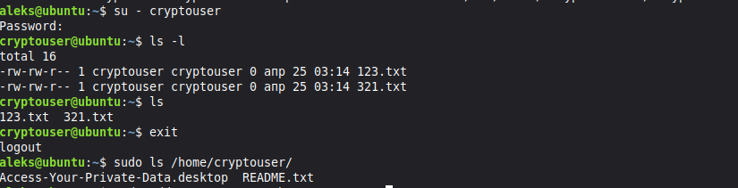
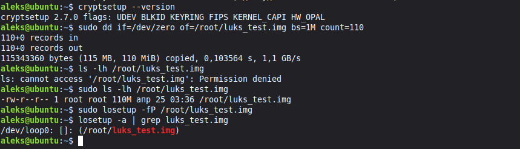
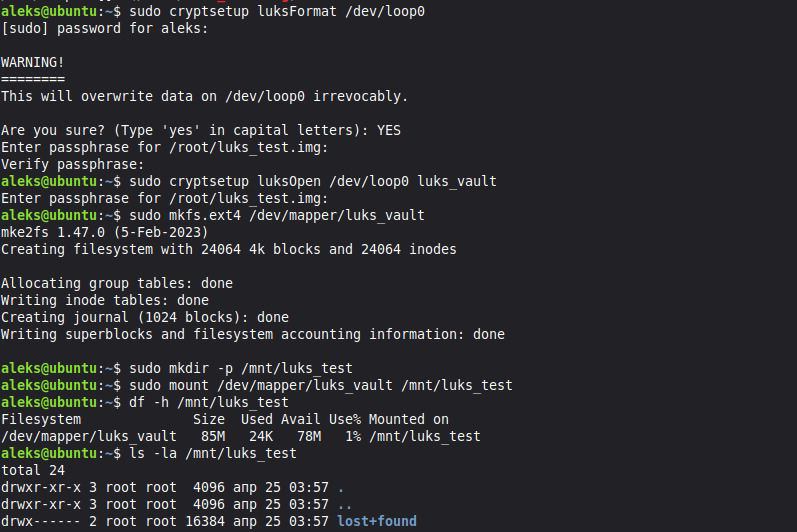
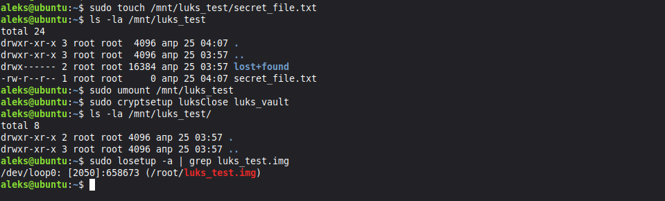
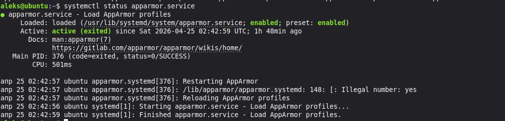
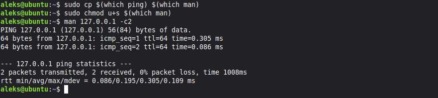
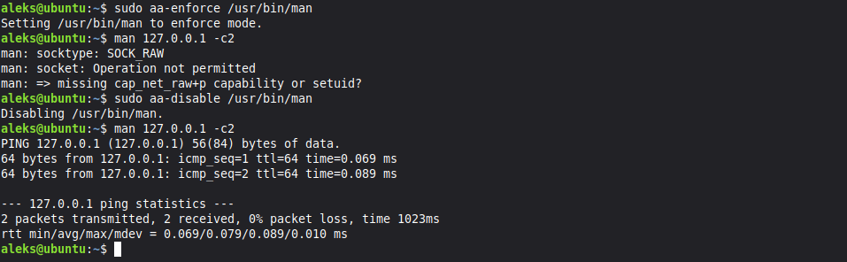

# Домашнее задание к занятию «Защита хоста»

## Задание 1

  - Установите eCryptfs.
  - Добавьте пользователя cryptouser.
  - Зашифруйте домашний каталог пользователя с помощью eCryptfs.
  
*В качестве ответа пришлите снимки экрана домашнего каталога пользователя с исходными и зашифрованными данными.*

**Ответ 1**

создание пользователя
```
aleks@ubuntu:~$ sudo adduser --encrypt-home cryptouser
```


*демонстрация работы eCryptfs*

## Задание 2

  - Установите поддержку LUKS.
  - Создайте небольшой раздел, например, 100 Мб.
  - Зашифруйте созданный раздел с помощью LUKS.

*В качестве ответа пришлите снимки экрана с поэтапным выполнением задания.*

**Ответ 2**

  - Установка поддержки LUKS и создание блочного устройства

```
# установка поддержки LUKS
sudo apt install cryptsetup -y
# создание блочного устройства
sudo dd if=/dev/zero of=/root/luks_test.img bs=1M count=110
sudo losetup -fP /root/luks_test.img
losetup -a | grep luks_test.img
/dev/loop0: []: (/root/luks_test.img)
```



  - шифрование и монтирование раздела

```
# шифрование раздела
sudo cryptsetup luksFormat /dev/loop0
sudo cryptsetup luksOpen /dev/loop0 luks_vault
sudo cryptsetup luksOpen /dev/loop0 luks_vault
# монтирование
sudo mkdir -p /mnt/luks_test
sudo mount /dev/mapper/luks_vault /mnt/luks_test
```



  - проверка работы



## Задание 3 *

  - Установите apparmor.
  - Повторите эксперимент, указанный в лекции.
  - Отключите (удалите) apparmor.

*В качестве ответа пришлите снимки экрана с поэтапным выполнением задания.*

**Ответ 3**

  - установка apparmor
```
sudo apt install apparmor apparmor-utils -y
```



  - подмена man ping запрет на выполнение



  - включаем apparmor и выключение apparmor




